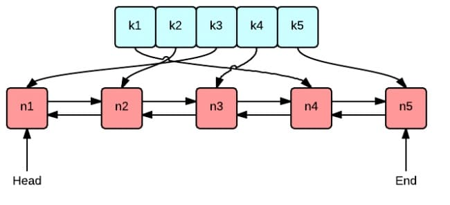

跟着[极客兔兔](https://geektutu.com/post/geecache-day1.html)七天实现分布式缓存，笔记和心得

**分布式缓存关注点**：

- 资源的控制
- 淘汰策略：FIFO、LFU、LRU
- 并发
- 分布式通信

**第一天**：

- 实现淘汰策略LRU算法：

  - 数据结构：

    

    map用于查，双向list用于新增和删除，lru把使用到的节点移动到链表尾，头结点就是最近最少使用的节点。代码中约定front为队尾，back为队首

  - 代码实现：

**第二天**：目标是实现单机并发缓存

- 实现可存任意数据类型的只读数据结构
  - 任意: []byte
  - 只读：不允许外界修改，使用copy
  
- 实现cache，对lru实例化，并封装add和get方法

- 实现getter：用户自定义方法实现指定接口技巧，

- 实现group，负责与用户的交互,实现流程 ⑴ 和 ⑶

  ```
  流程：                       是
  接收 key --> 检查是否被缓存 -----> 返回缓存值 ⑴
                  |  否                         是
                  |-----> 是否应当从远程节点获取 -----> 与远程节点交互 --> 返回缓存值 ⑵
                              |  否
                              |-----> 调用`回调函数`，获取值并添加到缓存 --> 返回缓存值 ⑶
  ```

  - 关于要不要实现支持多种数据源配置？不需要实现，一、数据源太多，二、扩展性不好，方案是设计回调函数。

**第三天**：为单机节点搭建 HTTP Server

- HttpPoll：实现通过URL获取Group名 ->查找group ->通过url获取key ->获取缓存值->缓存通过response body返回

**第四天**：一致性哈希，从单节点走向分布式节点

- 简单的mod的hash算法看起来没问题，但是在缓存服务器节点数改变时容易造成缓存雪崩

- 缓存雪崩：缓存同一时刻全部失效，造成db请求量突增，压力增加，引起血本，原因：1.缓存服务器宕机，2.缓存设置了相同的过期时间
- 一致性哈希：
  - 映射范围固定：2^32-1编号的环，解决节点/机器数变化的问题
  - 两次hash映射：1、将机器/节点（名称，编号，IP）做hash映射到环上，2、将key做hash映射到环上
  - 选择节点：key的哈希在环上的顺时针第一个hash值对应的机器/节点
  - 在新增或者减少节点时只需重新定位相对应节点附近的一部分数据而已
  - 节点或者机器太少时可能造成的数据倾斜问题：一个真实节点对应多个虚拟节点